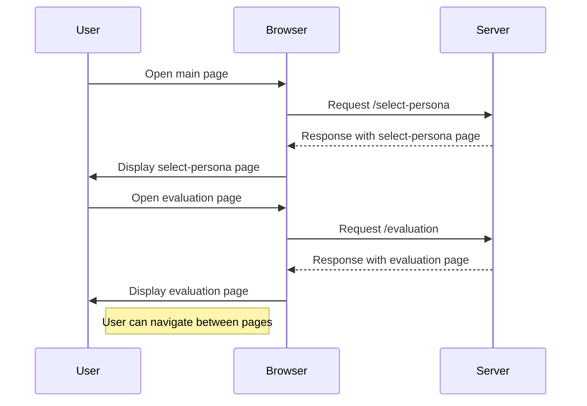
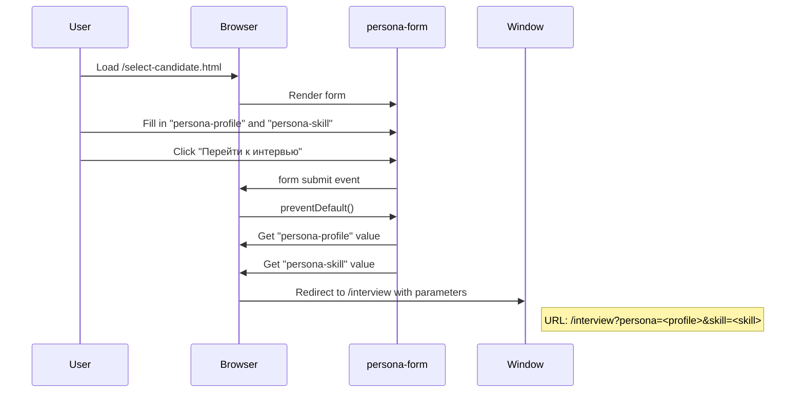
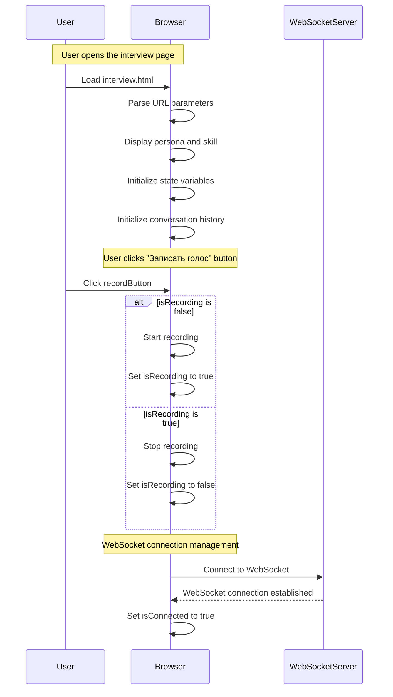
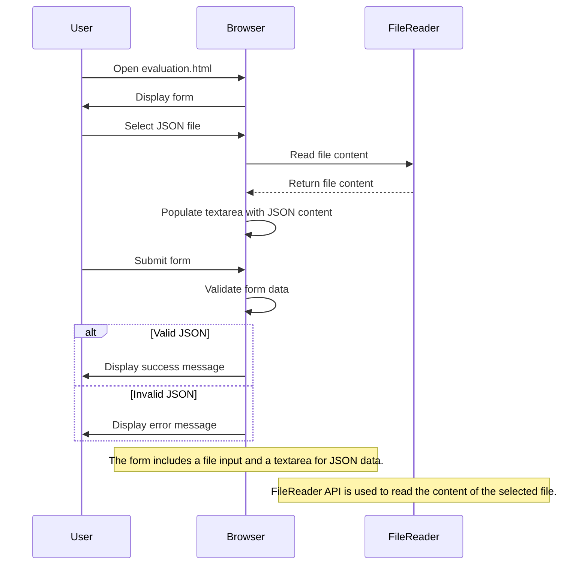
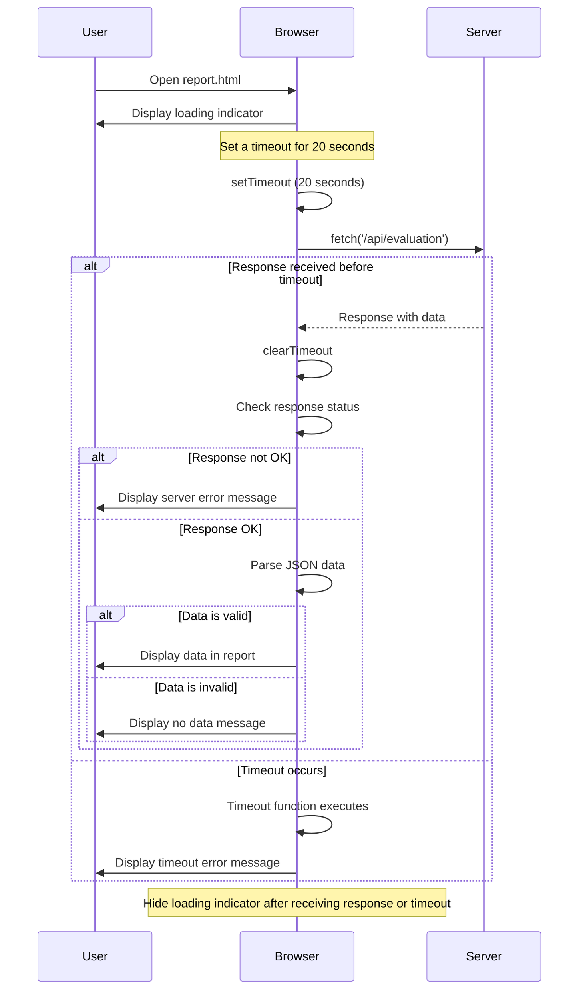

# **AI AGENT CONVERSATION**

#### **requirenments.txt**
[FASTAPI](https://fastapi.tiangolo.com/)

[UVICORN](https://pypi.org/project/uvicorn/)

[OPENAI](https://platform.openai.com/docs/api-reference/responses)

[OPENAI AGENT SDK](https://openai.github.io/openai-agents-python/)

---

### **Setup**

1. собрать проект -> ./setup.sh
2. добавить нужные ключи в .env файл
3. запустить проект -> ./dev.sh

---

### **Описание**

⎿  📁 app
     ├─ 📄 __init__.py
     ├─ 📁 agents                <!-- Агенты для различных задач -->
     │  ├─ 📄 evaluation_agent.py
     │  ├─ 📄 interviewee_agent.py
     │  ├─ 📁 prompts            <!-- Шаблоны и утилиты для агентов -->
     │  │  ├─ 📄 __init__.py
     │  │  ├─ 📄 evaluation_system_prompt.yaml
     │  │  ├─ 📄 persona_system_prompt.yaml
     │  │  ├─ 📄 utils.py
     │  ├─ 📁 tools              <!-- Инструменты для агентов -->
     │  │  ├─ 📄 answer_question.py
     │  │  ├─ 📄 extract_star.py
     ├─ 📁 api                   <!-- API для взаимодействия с фронтендом -->
     │  ├─ 📄 __init__.py
     │  ├─ 📄 evaluation.py
     │  ├─ 📄 interview.py
     ├─ 📁 core                  <!-- Основные конфигурации и константы -->
     │  ├─ 📄 __init__.py
     │  ├─ 📄 config.py
     │  ├─ 📄 constants.py
     │  ├─ 📄 openai.py
     ├─ 📁 frontend              <!-- HTML файлы для фронтенда -->
     │  ├─ 📄 evaluation.html
     │  ├─ 📄 index.html
     │  ├─ 📄 interview.html
     │  ├─ 📄 report.html
     │  ├─ 📄 select-candidate.html
     ├─ 📄 main.py               <!-- Главный файл запуска приложения -->
     ├─ 📁 model                 <!-- Модели для обработки данных -->
     │  ├─ 📄 __init__.py
     │  ├─ 📄 stt.py
     │  ├─ 📄 tts.py
     │  ├─ 📄 ttt.py
     ├─ 📁 utils                 <!-- Утилиты и вспомогательные функции -->
     │  └─ 📄 __init__.py

---

#### **Frontend**

##### index.html

---

##### select-candidate.html

---

##### interview.html

---

##### evaluation.html

---

##### report.html

---

